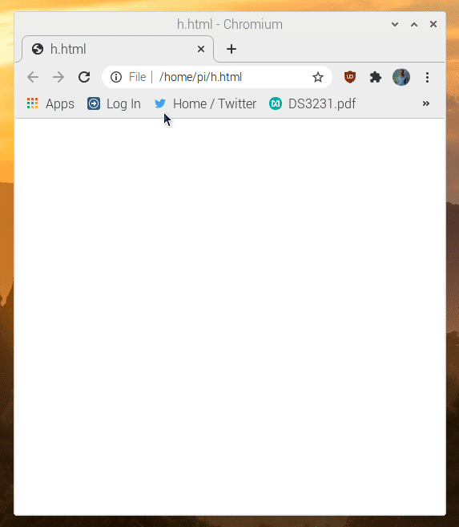

# pico-webserver

Webserver example that came with TinyUSB slightly modified to run on a Raspberry Pi Pico.
Lets the Pico pretend to be a USB Ethernet device. Runs a webinterface at http://192.168.7.1/

## Build dependencies

On Debian:

```
sudo apt install git build-essential cmake gcc-arm-none-eabi
```

Your Linux distribution does need to provide a recent CMake (3.13+).
If not, compile [CMake from source](https://cmake.org/download/#latest) first.

## Build instructions

```
git clone --depth 1 https://github.com/maxnet/pico-webserver
cd pico-webserver
git clone https://git.savannah.nongnu.org/git/lwip.git
git submodule update --init --depth 1
mkdir -p build
cd build
cmake ..
make
```

Copy the resulting pico_webserver.uf2 file to the Pico mass storage device manually (find it in uf2 directory for flash&trial as well).
Webserver will be available at http://192.168.7.1/

Content it is serving is in /fs
If you change any files there, run ./regen-fsdata.sh

By default it shows a webpage that led you toggle the Pico's led, and allows you to switch to BOOTSEL mode.

This is simple demonstration:  

